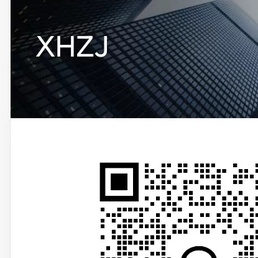
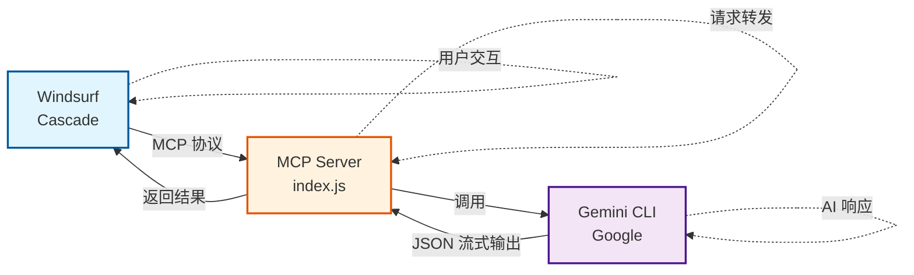

<div align="center">
  
  
  # Gemini-MCP-XHZJ
  
  🚀 让 Windsurf AI IDE 调用 Google Gemini，每日 1000 次免费额度！
  
  **专门适配 Windsurf AI IDE 的 Gemini MCP 服务。**
  
  [](LICENSE)
  [](https://nodejs.org/)
  
  <br/>
  
  ### 👋 交流学习
  
  <table>
    <tr>
      <td align="center">
        
        <br/>
        <b>加我好友</b>
      </td>
      <td align="center">
        
        <br/>
        <b>欢迎关注</b>
      </td>
    </tr>
  </table>
  
</div>

---

## ✨ 功能特点

- 🆓 **免费使用**：使用你自己的 Google 账号，每日 1000 次免费调用
- 🔄 **多账号切换**：配额用完可一键切换其他 Google 账号
- 🛡️ **代理支持**：内置 Clash 代理配置（端口 7890）
- 📝 **会话保持**：支持多轮对话上下文
- 🖥️ **Windows 友好**：提供中文管理工具

---

## 📁 项目结构

```
Gemini-MCP-XHZJ/
├── 📄 Gemini-MCP-XHZJ.bat      # 管理工具（检查状态/登录/切换账号）
├── 📄 mcp-config.json          # MCP 服务配置文件
├── 📄 windsurf_mcp_config.json # Windsurf MCP 配置示例
├── 📄 LICENSE                  # Apache-2.0 开源协议
├── 📄 README.md                # 本文件
└── 📂 mcp-servers/
    └── 📂 gemini-server/
        ├── 📄 index.js         # MCP 服务核心代码
        └── 📄 package.json     # Node.js 依赖配置
```

### 文件说明

| 文件 | 作用 |
|------|------|
| `Gemini-MCP-XHZJ.bat` | Windows 管理工具，双击运行可检查状态、登录、切换账号 |
| `mcp-config.json` | 代理和 Gemini CLI 的配置参数 |
| `windsurf_mcp_config.json` | Windsurf 的 MCP 配置示例，需复制到 Windsurf 配置目录 |
| `mcp-servers/gemini-server/index.js` | MCP 服务核心，封装 Gemini CLI 为 MCP 协议 |

---

## 🔧 安装步骤

### 第一步：安装前置依赖

#### 1. 安装 Node.js

下载并安装 [Node.js](https://nodejs.org/)（建议 LTS 版本）

验证安装：
```bash
node --version   # 应显示 v18.x.x 或更高
npm --version    # 应显示 9.x.x 或更高
```

#### 2. 安装 Gemini CLI

打开命令提示符（CMD）或 PowerShell，运行：
```bash
npm install -g @google/gemini-cli
```

验证安装：
```bash
gemini --version
```

#### 3. 准备代理工具

需要能访问 Google 的代理工具（如 Clash），默认端口 **7890**。

如果你的代理端口不是 7890，需要修改 `mcp-config.json` 中的端口号。

---

### 第二步：下载本项目

**方式一：Git 克隆**
```bash
git clone https://github.com/XHZJme/Gemini-MCP-XHZJ.git
```

**方式二：直接下载**

点击页面右上角绿色 `Code` 按钮 → `Download ZIP` → 解压到任意目录

---

### 第三步：登录 Google 账号

1. 确保代理已开启（Clash 等）
2. 双击运行 `Gemini-MCP-XHZJ.bat`
3. 输入 `2` 选择「登录认证」
4. 在弹出的界面中用方向键选择 `Login with Google`，按 Enter
5. 浏览器会自动打开，完成 Google 账号登录
6. 登录成功后，终端会显示认证成功

---

### 第四步：配置 Windsurf

1. 打开 Windsurf AI IDE
2. 按 `Ctrl + Shift + P` 打开命令面板
3. 输入 `Open MCP Config` 并选择
4. 在打开的配置文件中，添加以下内容：

```json
{
  "mcpServers": {
    "Gemini-MCP-XHZJ": {
      "command": "node",
      "args": [
        "你的项目路径\\mcp-servers\\gemini-server\\index.js"
      ],
      "env": {
        "HTTP_PROXY": "http://127.0.0.1:7890",
        "HTTPS_PROXY": "http://127.0.0.1:7890",
        "GEMINI_IDE_INTEGRATION": "false",
        "BROWSER": "echo",
        "GEMINI_CLI_SUPPRESS_BROWSER": "true"
      }
    }
  }
}
```

> ⚠️ 注意：将 `你的项目路径` 替换为实际路径，Windows 路径使用双反斜杠 `\\`

5. 保存配置，重启 Windsurf

---

## 🎮 使用方法

### 管理工具

双击 `Gemini-MCP-XHZJ.bat`，可以：

| 选项 | 功能 |
|------|------|
| 1 | 检查状态 - 查看 Gemini CLI 安装和认证状态 |
| 2 | 登录认证 - 用 Google 账号登录 |
| 3 | 切换账号 - 配额用完时切换其他账号 |
| 4 | 退出 |

### 在 Windsurf 中使用

配置完成后，Windsurf 的 AI 助手（Cascade）可以调用 Gemini 进行：
- 代码审查
- 技术问答
- UI/UX 设计建议

---

## ❓ 常见问题

### Q: 提示「Gemini CLI 未安装」？

运行以下命令安装：
```bash
npm install -g @google/gemini-cli
```

### Q: 登录时浏览器打不开？

1. 检查代理是否开启
2. 检查代理端口是否为 7890（或修改配置文件）
3. 手动打开浏览器访问终端显示的链接

### Q: 配额用完了怎么办？

1. 运行 `Gemini-MCP-XHZJ.bat`
2. 选择 `3` 切换账号
3. 用另一个 Google 账号登录

### Q: Windsurf 找不到 MCP 服务？

1. 检查配置文件路径是否正确
2. 检查 Node.js 是否已安装
3. 重启 Windsurf

---

## 📊 工作流程图



---

## 📜 开源协议

本项目采用 [Apache-2.0](LICENSE) 协议开源。

---

## 🙏 致谢

- **老金** - 本项目基于 Claudecode-Codex-Gemini 二次开发
- **Google Gemini** - 提供 CLI 工具 和 强大的模型能力

---

## Contributors

<a href="https://github.com/XHZJme/Gemini-MCP-XHZJ/graphs/contributors">
  
</a>

## Star History

[](https://star-history.com/#XHZJme/Gemini-MCP-XHZJ&Date)
